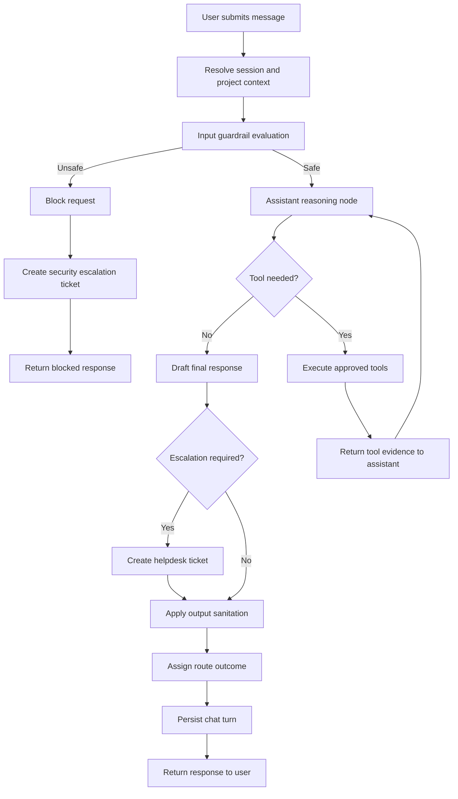
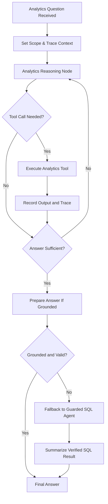

# AI Assistant Workflow

## Purpose and Scope
This document explains the operational workflow of the AI Assistant from the moment a user sends a message to the final response shown in the product. It describes what happens, why each stage exists, and how the system balances usefulness, safety, and governance.

The workflow includes:
- The user-facing assistant journey
- Guardrail-based safety routing
- Tool-assisted reasoning and response generation
- Ticket creation and escalation paths
- Post-response safety checks
- The SQL analytics agent flow used for analytics questions

This is a behavior-level document. It intentionally focuses on decisions, controls, and outcomes rather than implementation details.

## Design Principles
The assistant workflow is designed around five principles:

1. Safety first.
Every incoming message is checked before tool use or generation so harmful or unauthorized requests are contained early.

2. Grounded answers over guesswork.
The assistant is expected to rely on trusted data sources (knowledge retrieval, ticket search, analytics tools) for factual responses.

3. Least-privilege access.
Data access is scoped to user role and project membership to prevent cross-project leakage.

4. Human escalation when needed.
When self-service is unsafe, uncertain, or insufficient, the workflow creates a ticket and routes work to helpdesk teams.

5. Clear user outcomes.
Each turn ends with a clear route outcome: blocked, self-resolution guidance, follow-up, or ticket-created.

## End-to-End Workflow (User Assistant)

### 1. User session context is resolved
When a user submits a message, the assistant first resolves identity and session context, including:
- User identity
- Role and clearance
- Thread context
- Project scope
- Environment or application context (if provided)

Why this exists:
- Ensures responses are generated in the correct security and business context
- Prevents the assistant from operating with anonymous or stale assumptions
- Enables project-specific data boundaries

### 2. Input guardrail evaluation runs first
The message is immediately evaluated by guardrails before normal assistant reasoning.

Guardrails detect patterns such as:
- Prompt injection attempts
- Attempts to extract hidden instructions
- Unauthorized privilege escalation or sensitive secret requests

If guardrail fails:
- The request is blocked
- A security-oriented escalation ticket is created
- The user receives a refusal message explaining authorization requirements

If guardrail passes:
- The workflow proceeds to assistant reasoning

Why this exists:
- Reduces blast radius by preventing unsafe requests from entering the normal tool loop
- Creates an auditable escalation path for security-relevant events

### 3. Assistant reasoning and intent handling
For safe requests, the assistant evaluates the user intent and decides whether to:
- Provide guidance directly
- Call one or more tools to gather evidence
- Ask for additional clarifying detail
- Escalate to ticket creation

Typical intent families include:
- Knowledge/how-to help
- Existing ticket lookup or status checks
- Analytics and reporting questions
- Similar-incident discovery
- New ticket creation requests

Why this exists:
- Different question types require different evidence sources
- Intent-aware routing reduces unnecessary tool calls and improves response quality

### 4. Tool orchestration loop (LangGraph)
The assistant can enter a controlled reasoning loop:
- Assistant proposes tool calls
- Tools execute against allowed data sources
- Tool outputs are returned to the assistant
- Assistant either finalizes an answer or requests another tool step

Primary evidence sources:
- Knowledge retrieval for self-service instructions
- Existing ticket search for known incidents
- Semantic ticket search for similar historical cases
- Analytics agent for exact counts, trends, and breakdowns

Why this exists:
- Keeps factual responses anchored to data
- Separates generation from retrieval, reducing hallucination risk

### 5. Ticket escalation and creation
When the issue needs human intervention, the assistant creates a helpdesk ticket.

Common escalation triggers:
- Explicit user request to file a ticket
- Access or privilege changes requiring approval
- Hardware replacement or operational intervention
- No reliable self-service path available

Ticket creation captures:
- User and thread context
- Requested issue summary and priority/category signals
- Conversation context helpful for triage

Why this exists:
- Converts unresolved conversation into an actionable operational artifact
- Preserves context so support teams can act faster

### 6. Output safety sanitation
Before the final assistant response is returned, response text is sanitized for sensitive data.

Sanitation focus:
- Secrets and credential-like patterns
- Personally identifiable information

Why this exists:
- Adds a final safety net in case sensitive content appears in model output
- Supports compliance and data-protection requirements

### 7. Final route and persistence
The turn is finalized with a route label and response payload for the UI:
- `blocked`
- `self_resolution`
- `ticket_created`
- `follow_up`

Conversation history is persisted so threads remain continuous over time.

Why this exists:
- Provides consistent frontend behavior and auditable interaction history

## LangGraph Conversation Flow

## SQL Analytics Agent Workflow
For analytics-style questions (counts, trends, groupings, operational reporting), the assistant delegates to a dedicated analytics workflow.

### What this agent does
- Answers analytics questions using read-only data access patterns
- Prefers structured analytics tools for exactness
- Uses semantic search only for thematic or qualitative insights
- Falls back to guarded SQL when structured tools cannot express a question

### Why this agent exists
- Separates conversational helpdesk behavior from reporting behavior
- Produces more reliable numeric answers by grounding in queryable data
- Enforces strict read-only posture for analytics operations

### Governance behaviors
- Read-only query policy is enforced
- Tool usage is preferred over free-form model claims
- Project scoping is enforced for scoped users
- If a grounded answer is not produced in the primary path, a controlled fallback attempts to recover a verifiable answer

## LangGraph Analytics Flow

## Unified Decision Logic (What users experience)

### A. Blocked security request
User experience:
- The assistant refuses the request and explains that authorization is required.

Operational outcome:
- A high-priority security escalation artifact is created for human review.

### B. Self-resolution path
User experience:
- The assistant provides actionable steps and references grounded in trusted knowledge.

Operational outcome:
- No ticket is created unless user asks or evidence indicates escalation is necessary.

### C. Analytics answer path
User experience:
- The assistant returns exact counts/trends for report-style questions.

Operational outcome:
- Answers are grounded in governed analytics tools and read-only data pathways.

### D. Ticket-created path
User experience:
- The assistant confirms that a ticket was filed and that support will follow up.

Operational outcome:
- Support teams receive a structured case with conversation context for triage.

## Why this workflow is robust

1. It blocks risky behavior early.
Pre-generation guardrails reduce the chance of unsafe interactions progressing through normal reasoning.

2. It separates factual grounding from language generation.
Tools and retrieval systems provide evidence; the model focuses on synthesis and communication.

3. It keeps access boundaries explicit.
Role and project scoping are enforced throughout assistant and analytics pathways.

4. It supports graceful degradation.
When one path cannot produce a trustworthy answer, controlled fallback paths aim to recover a grounded result.

5. It preserves operational continuity.
Unresolved cases become tickets with context, ensuring conversations can transition into human workflows.

## Recommended Usage in Operations Reviews
Use this workflow to align stakeholders on:
- Security and compliance controls
- Reliability of analytics outputs
- Escalation criteria for human support
- Data-governance boundaries by role and project
- User experience expectations per route outcome
