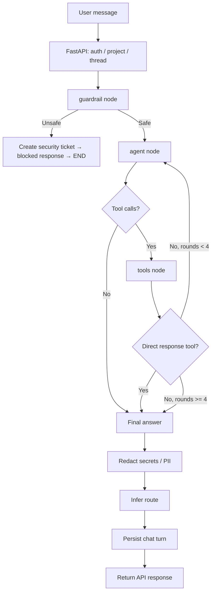
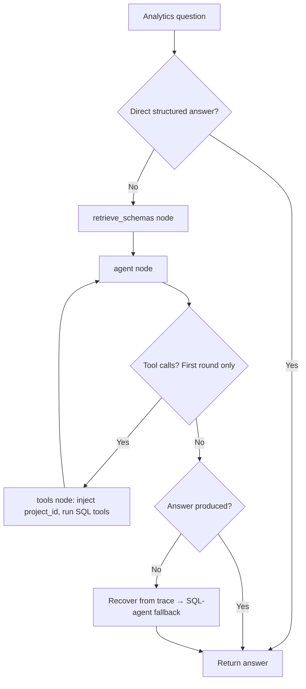
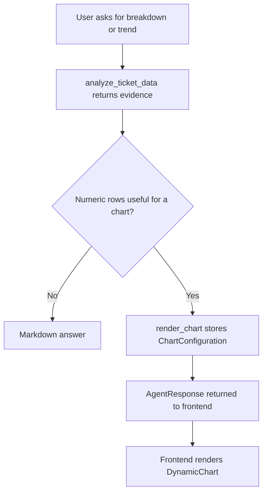

# AI Assistant Workflow

## Overview

The assistant runs as two separate LangGraph pipelines:

- **Helpdesk graph** (`app/graph.py`) — user-facing ReAct loop.
- **Analytics graph** (`app/admin_analytics.py`) — admin analytics delegation.

FastAPI resolves authenticated identity, role, clearance, project membership,
and thread scope before invoking either graph.

## Helpdesk Graph

### Flow

### Registered Tools

| Tool | Purpose |
|---|---|
| `search_knowledge_base` | Vector search over KB articles and runbooks |
| `find_tickets` | Ticket lookup by keyword, topic, or symptoms (`semantic=true`) |
| `analyze_ticket_data` | Delegates to analytics graph for counts, trends, breakdowns |
| `retrieve_ticket_comments` | Vector search over ticket comments |
| `create_helpdesk_ticket` | Creates a ticket and returns a direct response |
| `render_chart` | Stores chart config for frontend rendering |

### Guardrails

The guardrail node blocks prompt injection, credential disclosure, and privilege
escalation attempts. Blocked turns always create a critical security ticket.

### Route Labels

| Route | Condition |
|---|---|
| `blocked` | Guardrail fired |
| `ticket_created` | `create_helpdesk_ticket` was called |
| `self_resolution` | KB references attached |
| `follow_up` | All other turns |

## Analytics Graph

Called via `analyze_ticket_data` (helpdesk tool) or `POST /api/admin/analytics`.

### Flow

### Analytics Tools

`count_tickets`, `group_tickets`, `list_tickets`, `ticket_trend`,
`semantic_ticket_search`, `describe_analytics_schema`, `run_read_only_sql`

Structured tools receive enforced `project_id` injection for project-scoped
users. All SQL execution is read-only.

## Chart Response Flow

Charts are produced by the helpdesk graph, not the analytics graph.

## Persistence

| Store | Contents |
|---|---|
| `chat_messages` | User and assistant messages, optional `agent_response` JSON |
| `tickets` | Tickets with category, priority, keywords, project |
| `langgraph_checkpoints.sqlite` | LangGraph state checkpoints |

Deleting chat history removes `chat_messages` rows only — LangGraph checkpoint
rows for the same thread are not cleared.

## Known Gaps

- Non-admin arbitrary SQL paths are read-only but not project-rewritten.
- Ticket/comment vector retrieval has clearance-filtering inconsistencies.
- Ticket insights retrieve KB context as `internal` clearance regardless of requester clearance.
- Chat thread deletion does not clear LangGraph checkpoints.
