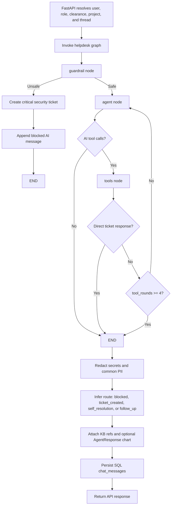
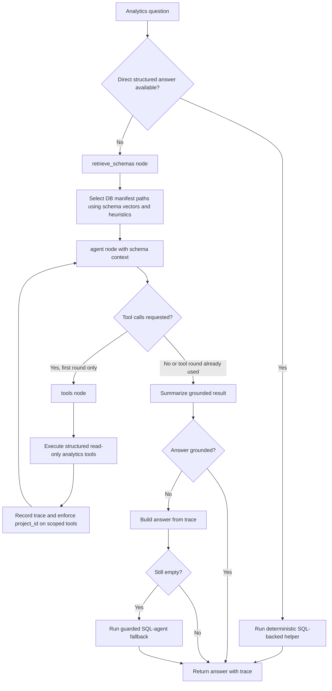

# Architecture

Capstone ITS v2 is a FastAPI application with a Vite React frontend, a
LangGraph-powered helpdesk assistant, a separate LangGraph analytics workflow,
SQLite operational storage, and Pinecone-backed vector retrieval. The current
implementation is a tool-calling ReAct-style assistant, not the older
multi-node structured triage graph that earlier drafts described.

## Runtime Components

- **FastAPI** serves JSON APIs, auth routes, static assets, legacy templates,
  protected documentation, and the production React build when
  `frontend/dist/index.html` exists.
- **React frontend** lives in `frontend/` and uses Vite, React Router, Recharts,
  React Markdown, and Lucide. It does not use Refine.js.
- **LangGraph** runs two workflows: the user-facing helpdesk graph and the
  admin analytics graph.
- **LangChain** wraps chat models, tool binding, Pinecone vector stores,
  SQL-agent fallback, and FlashRank reranking.
- **Pydantic** validates API request payloads, database transfer objects,
  ticket metadata, chart responses, comment classifications, and tool input
  schemas.
- **SQLite + SQLAlchemy** stores users, sessions, projects, chat messages,
  tickets, ticket messages, ticket comments, tags, KB/project links,
  background jobs, and ticket insight cache records.
- **Pinecone** stores KB vectors, ticket vectors, ticket comment vectors, and
  DB schema manifest vectors.
- **Background worker** processes queued vector upserts/deletes and ticket
  insight refreshes.

## API Surface

Core user routes:

- `POST /api/chat`: runs a non-streaming assistant turn.
- `POST /api/chat/stream`: runs a streaming assistant turn over SSE.
- `GET /api/chat/history`: returns persisted chat messages for a thread.
- `GET /api/chat/threads`: lists recent chat threads for the signed-in user.
- `DELETE /api/chat/threads/{thread_id}`: deletes SQL chat history for a
  thread.
- `GET /api/tickets`: returns project-scoped ticket rows.
- `POST /api/tickets`: creates a manual helpdesk ticket.
- `GET /api/tickets/{id}`: returns one ticket with optional conversation and
  raw context.
- `GET /api/tickets/{id}/comments`: lists threaded ticket comments.
- `POST /api/tickets/{id}/comments`: creates a ticket comment.
- `GET /api/tickets/{id}/insights`: returns cached or freshly generated ticket
  insight data.
- `GET /api/kb/doc`: serves a markdown KB document after clearance and project
  checks.
- `GET /api/projects`: lists active projects visible to the user.
- `GET /api/tags`: lists tag metadata.
- `GET /api/health`: basic service probe.

Admin and auth routes:

- `POST /auth/register`, `POST /auth/login`, `POST /auth/logout`,
  `GET /auth/me`, `POST /auth/change-password`, and
  `POST /auth/reset-password`.
- `GET /docs` and `GET /openapi.json` are admin-only.
- `GET /api/admin/insights` and `POST /api/admin/analytics` are admin-only.
- Project member management and user listing routes are admin-only.
- Comment update/delete routes are admin-only.

## Frontend Routes

The React app currently defines these client routes:

- `/`: ticket dashboard.
- `/assistant`: AI assistant console.
- `/tickets/:ticketId`: ticket detail view.
- `*`: redirects to `/`.

The backend can serve the React shell for additional entrypoint URLs such as
`/login`, `/register`, and `/admin`, but those are not separate React routes in
the current frontend.

## SQL Models

Defined in `app/db.py`:

- `users`: application identities, roles, clearance, active state, and password
  hashes.
- `auth_sessions`: opaque session tokens with expiry and request metadata.
- `chat_messages`: persisted assistant conversations outside ticket workflows,
  including optional serialized `agent_response` chart payloads.
- `projects` and `project_members`: project ownership and membership scope.
- `tags`, `ticket_tags`, `kb_tags`, and `kb_project_links`: labels and
  project-aware KB/ticket relationships.
- `tickets`: ticket lifecycle state, user/thread ids, app/environment,
  clearance, project id, category, priority, summary, keywords, serialized
  intelligence/resolution/guardrail/conversation/raw context, and timestamps.
- `ticket_messages`: normalized message audit trail per ticket.
- `ticket_comments`: threaded ticket discussion comments.
- `background_jobs`: durable queue for vector indexing and insight refresh
  work.
- `ticket_insights`: cached expensive insight payloads.

`ticket_kb_links` and `duplicate_ticket_links` are legacy tables that are
explicitly dropped by migrations. Dynamic insights now compute and cache
references instead of persisting those link tables.

LangGraph checkpoints are stored separately by `SqliteSaver` in
`data/langgraph_checkpoints.sqlite`. Deleting SQL chat history does not
currently remove LangGraph checkpoint state for the same thread.

## LangGraph Workflows

### Helpdesk Assistant

Defined in `app/graph.py`.



Active state is the local `HelpdeskAgentState` in `app/graph.py`. It uses
LangGraph's `add_messages` reducer for LangChain messages and carries session
metadata, blocked/direct-response flags, route, and a per-turn `tool_rounds`
counter. The older `HelpdeskGraphState` in `app/schemas.py` is retained but is
not the active graph state.

Registered helpdesk tools:

- `search_knowledge_base`
- `find_tickets`
- `analyze_ticket_data`
- `retrieve_ticket_comments`
- `create_helpdesk_ticket`
- `render_chart`

`search_existing_tickets` and `vector_search_tickets` are decorated as tools in
code, but they are not registered in the `TOOLS` list and are therefore not
available to the helpdesk graph.

### Admin Analytics

Defined in `app/admin_analytics.py`.



Analytics tools:

- `count_tickets`
- `group_tickets`
- `list_tickets`
- `ticket_trend`
- `semantic_ticket_search`
- `describe_analytics_schema`
- `run_read_only_sql`

The analytics graph compiles without a checkpointer. It is request-scoped and
keeps trace metadata for the API response.

## Tool And Integration Surface

Model construction is centralized in `app/llm.py`.

- Chat providers: OpenAI, Ollama, NVIDIA endpoints, and Groq.
- Embedding providers: OpenAI, Hugging Face, and NVIDIA endpoints.
- Optional LangSmith tracing is configured through settings.

Vector indexes:

- `PINECONE_KB_INDEX_NAME`, default `its-knowledge-base`.
- `PINECONE_TICKET_INDEX_NAME`, default `its-tickets`.
- `PINECONE_COMMENT_INDEX_NAME`, default `its-comments`.
- `PINECONE_DB_INDEX_NAME`, default `its-db-schema`.

Ingestion and worker scripts:

- `scripts/ingest_kb.py`: markdown KB ingestion.
- `scripts/ingest_tickets.py`: CSV import, ticket vector indexing, comment
  import/indexing, and optional vector reset.
- `scripts/ingest_db_manifest.py`: DB schema manifest vector ingestion.
- `scripts/run_worker.py`: durable background job worker.
- `scripts/migrate_db.py`: database migrations.

## Guardrails And Governance

- FastAPI/Pydantic validation limits payload sizes, enum values, and request
  shape.
- Authentication uses bcrypt password hashes and opaque session tokens.
- Role checks protect admin-only APIs.
- Non-admin ticket APIs enforce project membership and hide inaccessible tickets
  with `404`.
- Chat identity, clearance, and project scope are derived from the authenticated
  session instead of trusting client-supplied values.
- `app/guardrails.py` performs deterministic regex checks for prompt injection,
  hidden prompt extraction, unauthorized privilege/access requests, and
  credential disclosure patterns.
- Unsafe assistant input creates a critical security ticket and returns a
  blocked response.
- Final assistant output is redacted for secrets, private keys, emails, phone
  numbers, and SSNs.
- KB vector retrieval applies clearance and metadata filters; direct KB document
  fetch also enforces clearance and project links.
- Admin analytics uses read-only SQL controls, including table allowlisting,
  `PRAGMA query_only`, write-verb blocking, sensitive table/column checks,
  single-statement checks, and cursor-level assertion hooks.

## RAG Pipeline

Defined in `app/rag.py`, `app/rag_ingest.py`, and `app/rag_retrieve.py`:

1. Load Markdown files from `kb/`.
2. Parse front matter to normalize metadata such as `kb_id`, `category`,
   `clearance` or `clearance_level`, `app_name`, `environment`, tags, audience,
   and department.
3. Split markdown content into retrievable chunks.
4. Store chunks in the Pinecone KB index with configured embeddings.
5. At query time, build a Pinecone metadata filter from user clearance,
   category, app, environment, audience, and department context.
6. Rerank candidate documents with FlashRank.
7. Convert selected documents into `KBArticleRef` citation payloads.

## Known Implementation Gaps

These are current documentation-relevant gaps and should be treated as follow-up
engineering work before production hardening:

- Non-admin analytics structured tools are project-scoped, but arbitrary SQL
  paths are read-only rather than deterministically project-rewritten.
- Ticket/comment vector retrieval is project-scoped but has inconsistent
  clearance filtering.
- Ticket insights currently retrieve KB context using internal clearance,
  independent of the requester's clearance.
- Any authenticated user can create a project and become owner. This should be
  documented as intentional self-service or restricted.
- `render_chart` can attach an `AgentResponse` chart payload; the current
  frontend chart component renders the chart when a chart is present and does
  not display `markdown_text` in that structured chart component.
- The current frontend includes a `Reasoning` component, but reasoning stream
  handling is disabled.

## Runbook

```bash
uv sync
cp .env.example .env
uv run python scripts/ingest_kb.py
uv run python scripts/ingest_db_manifest.py
uv run python scripts/ingest_tickets.py
uv run python scripts/run_worker.py
uv run uvicorn app.main:app --reload
```

For the frontend:

```bash
cd frontend
npm install
npm run dev
```
